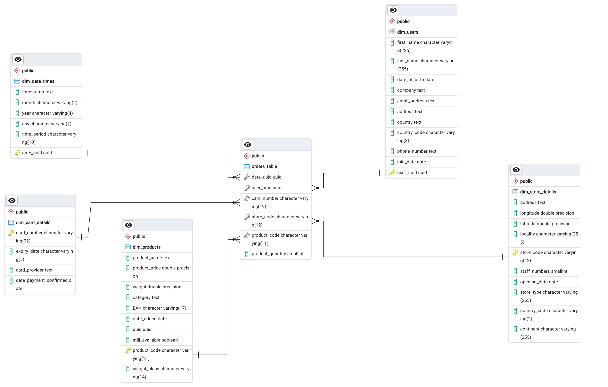

# multinational-retail-data-centralisation186

# Table of content
- Description
- Installation instructions
- Usage instructions
- File structure of the project
- License information
  
# Description
This project is about creating a set of python classes for collecting data in multiple formats present in multiple data sources for the Multinational Retail Store and transforming it to a well structured tables in a PostreSQL Data Warehouse using Star Schema so that it is earily querable for Analytics and Insights generation.

This project collects raw data stored in the following formats:
- CSV files
- API endpints
- PDF files
- AWS RDS tables
- JSON files

The classes perform data cleaning tasks on the source data to ensure the data is free from wrong formatted, missing or erroneous cells. It then stores the clean data in a PostgreSQL data warehouse tables.

The project builds a Star Schema relationship between the different tables in the Data Warehouse using SQL, and finally presents a number of analytics SQL code examples for gleaning insights from about the Retail Store performance.

# ERP Diagram



# Installation instruction
You will need Python 3+ installed on your machine

You will need GitHub installed on your machine if you want to clone this repo, otherwise you can just download it from GitHub as zip file.

You can run the data_cleaning.py file locally on your machine, which then uses the DatabaseConnector, DataExtractor, and DataCleaning classes to connect to and fetch the raw the data from source, clean it, and finally store in the a local database:

1- open your temrinal or cmd window

2- navigate to the location of the main.py file

3- run main.py by using the following command:

> python main.py

4- follow the instructions presented in the console to choose between running selected components of the data transformation pipeline, or running the entire pipeline all at once.

```
>> Press a number to run (press q to quit):
                            1- run_warehouse_users()
                            2- run_pdf_cards_details()
                            3- run_api_stores()
                            4- run_s3_products()
                            5- run_warehouse_orders()
                            6- run_json_events()
                            7- run entire pipeline! It takes some time to complete!
```

4- on finishing to create the PostgreSQL warehouse tables using the Python code above, it is time to run the sql chunks in the star_schema_conversion.sql code.

5- One option is to open the pgAdmin console connected to the data warehouse, then run each portion of the SQL code in the file one by one manually. You may have to change some of the VARCHAR(max_nmber) based on the max_number you get from the predecessor queries if your data is different.

6- You can get some insight into how the Multinational Retail Store is doing by opening the querying_DB_for_insights.sql file and choosing to run some of the analytical queries documented in there!

# File structure
The directory includes a number of files:
- __main.py__: This file is the main file to use for running selected components of the pipeline, or the entire pipeline at once.
- __data_utils.py__: This file contains the DatabaseConnector class. It is responsible for connecting to the AWS RDS and PostgreSQL Data Warehouses.
- __data_extraction.py__: This file contains the DataExtractor class. It is responsible for extracting the raw data from different data sources, such as S3 buckets, API end points, and PDF files.
- __data_cleaning.py__: This file contains the DataCleaning class. It is responsible for cleaning the extracted raw data.
- __db_creds.yaml__: for local and remote databases. It includes credentials needed to connect to the AWS RDS and PostgreSQL data Warehouses. These files are excluded in the .gitignore file. but a empty template file is present to be repurposed by users.
- __stare_schema_conversion.sql__: contains the SQL code to format the dim tables and fact table columns and to establish the primary and foreign keys for the desired Star Schema.
- __querying_DB_for_insights.sql__: contain the analytics SQL code to glean insights from the data, and answer important business questions.
- __README.md__: Is where the documentation of this project is noted and kept.

# License information
This code is released under the Creative Common CC BY 4.0 DEED License. 
